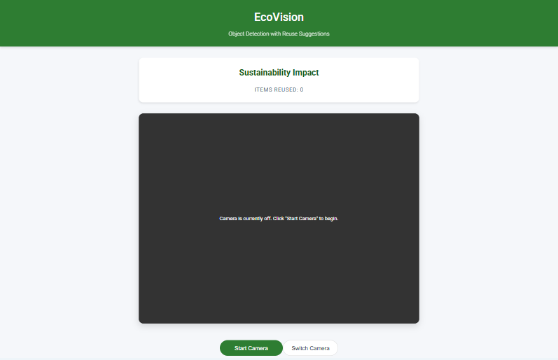

# ♻️ EcoVision – Object Detection & Reuse Assistant

[](https://www.tensorflow.org/js)
[](https://opensource.org/licenses/MIT)
[](https://www.netlify.com/)
[](https://developer.mozilla.org/en-US/docs/Web/HTML)

A smart sustainability web app that uses real-time object detection to suggest creative ways to **reuse** everyday items. Powered by **TensorFlow.js**, EcoVision helps you turn trash into treasure through visual recognition and curated DIY ideas.

<p align="center">
  
</p>

---

## 🌟 Features

- 🎥 **Live Object Detection**  
  Runs in-browser using TensorFlow.js and the COCO-SSD model.

- 🧠 **Interactive Reuse Suggestions**  
  Click on detected objects to explore DIY ideas.

- 📱 **Mobile-Responsive & Front/Back Camera Toggle**  
  Seamless experience across devices with camera switching support.

- 📊 **Reuse Impact Tracker**  
  Tracks how many items you’ve reused locally.

- ⚡ **Runs Fully in the Browser**  
  No backend or installations required.


---

## 🔧 Prerequisites

- ✅ Modern browser (Chrome, Edge, Firefox)
- ✅ Webcam or phone camera
- ✅ JavaScript enabled
- ✅ (Optional) Node.js + npm for local server

---

## 🚀 Getting Started

### 🔁 Run Locally (Optional)

```bash
git clone https://github.com/affanabid/ecovision.git
cd ecovision
npx http-server -p 5500
```

Then open http://127.0.0.1:5500 in your browser.

---

## 🌐 Deployment

This project is deployed on **Netlify**.

👉 **Live Demo:** https://snaptoreuse.netlify.app/

---

## 💡 Usage Guide

1. Click **Start Camera**
2. Show an object (e.g., bottle, book)
3. Click its bounding box → see reuse suggestions
4. Click **Mark as Reused** to track impact
5. Use the **camera toggle** to switch between front/back view

---

## ⚙️ Technical Details

- **Model**: COCO-SSD via TensorFlow.js  
- **Detection**: In-browser using live webcam stream  
- **Logic**: Bounding box detection + interactive popups  
- **Ideas Source**: `reuseIdeas.json` file with mapped links

---

## 🔍 Troubleshooting

### Camera not working?
- Ensure you’ve granted camera permission to the browser
- Must run over **HTTPS** or **localhost** (due to webcam access restrictions)

### Detection not accurate?
- COCO-SSD supports only **80 common objects**
- You can upgrade to a **custom-trained model** or one trained on a larger dataset

---

## 🤝 Contributing

Contributions are welcome!  

```bash
# Fork the repo
# Create a branch
git checkout -b feature/my-feature

# Commit your changes
git commit -m "Add your feature"

# Push and open a Pull Request
git push origin feature/my-feature
```
---
## 📬 Contact

Affan Abid – [@affanabid](https://github.com/affanabid)  
Project Link – [https://github.com/affanabid/ecovision](https://github.com/affanabid/ecovision)
---


